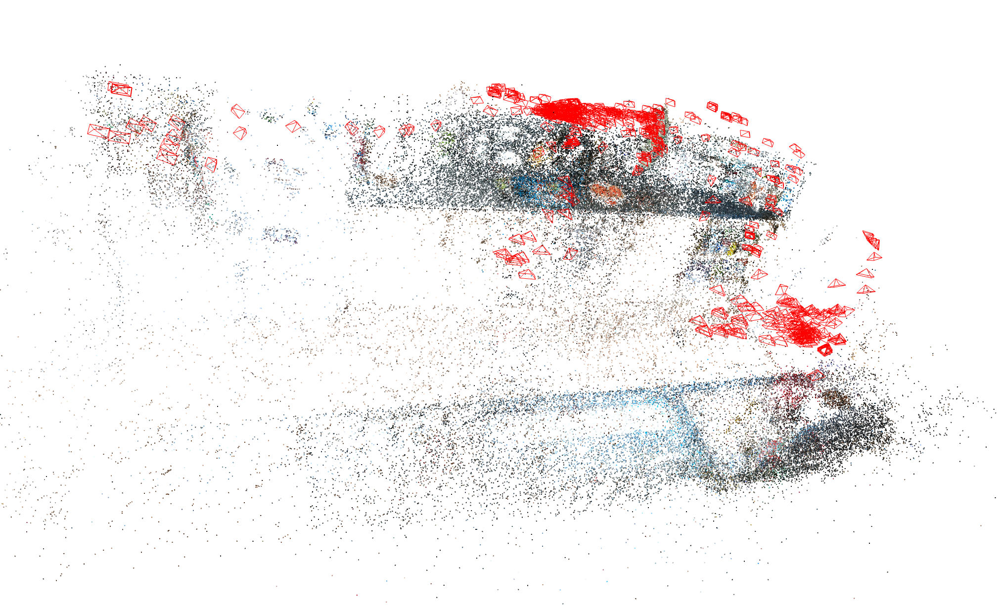
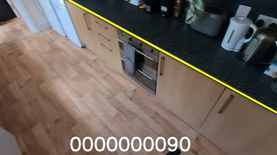

# EPIC Fields: Marrying 3D Geometry and Video Understanding 


This repository provides tools and scripts for visualizing and reconstructing the [EPIC FIELDS](https://epic-kitchens.github.io/epic-fields) dataset.

## Table of Contents

1. [Visualization Code](#visualization-code)
   - [Introduction](#introduction)
   - [Format](#format)
   - [Visualization](#visualisation)
2. [Reconstruction Pipeline](#reconstruction-pipeline)
   - [Steps for EPIC-KITCHENS Reconstruction](#steps-for-epic-kitchens-reconstruction)
   - [Understanding the Output File Structure](#understanding-the-output-file-structure)
3. [Additional info](#additional-info)
   - [Credit](#credit)
   - [Citation](#citation)
   - [License](#license)
   - [Contact](#contact)


 
# Visualization Code
## Introduction

This visualisation code is associated with the released EPIC FIELDS dataset. Further details on the dataset and associated preprint are available at:
[https://epic-kitchens.github.io/epic-fields](https://epic-kitchens.github.io/epic-fields)


## Format

- The `camera` parameters use the COLMAP format, which is the same as the OpenCV format.
- The `images` stores the world-to-camera transformation, represented by quaternion and translation. 
    - Note: for NeRF usage this needs to be converted to camera-to-world transformation and possibly changing (+x, +y, +z) to (+x, -y, -z)
- The `points` is part of COLMAP output. It's kept here for visualisation purpose and potentially for computing the `near`/`far` bounds in NeRF input.
```
{
    "camera": {
        "id": 1, "model": "OPENCV", "width": 456, "height": 256,
        "params": [fx, fy, cx, cy, k1, k2, p1, p2]
    },
    "images": {
        frame_name: [qw, qx, qy, qz, tx, ty, tz],
        ...
    },
    "points": [
        [x, y, z, r, g, b],
        ...
    ]
}

example data can be found in `example_data/P28_101.json`
```

## Visualisation

### Visualise camera poses and pointcloud 

This script requires Open3D. This script is tested with Open3D==0.16.1.
```python
python tools/visualise_data_open3d.py --json-data example_data/P28_101.json
```
PS: Press 'h' to see the Open3D help message.

<details>
    <summary>Click to see the example output</summary>
    
</details>

### Example: Project a 3D line onto epic-kitchens images using camera poses

```python
python tools/project_3d_line.py \
    --json-data example_data/P28_101.json \
    --line-data example_data/P28_101_line.json \
    --frames-root example_data/P28_101/
```
<details>
    <summary>Click to see the example output</summary>
    
</details>

To draw a 3D line, one option is to download the COLMAP format data and use COLMAP GUI to click on points.


---


# Reconstruction Pipeline

This section contains the pipeline for the dataset introduced in our paper, "EPIC Fields: Marrying 3D Geometry and Video Understanding." We aim to bridge the domains of 3D geometry and video understanding, leading to innovative advancements in both areas.

## Steps for EPIC-KITCHENS Reconstruction

This section outlines the procedure to achieve the [EPIC-KITCHENS](https://epic-kitchens.github.io) reconstructions using our methodology.

### Step 0: Prerequisites and Initial Configuration

#### 1. Installing COLMAP (preferably with CUDA support)

To efficiently process and reconstruct the frames, it's recommended to install COLMAP with CUDA support, which accelerates the reconstruction process using NVIDIA GPUs.

You can download and install COLMAP from their official website. For detailed installation instructions, especially on how to enable CUDA support, refer to the [COLMAP installation guide](https://colmap.github.io/install.html).

#### 2. Cloning the Repository

To proceed with the subsequent steps, you'll need to clone the current repository. Run the following commands:

```bash
git clone https://github.com/epic-kitchens/epic-fields-code.git
cd epic-fields-code
```

#### 3. Downloading Vocabulary Trees
COLMAP utilizes vocabulary trees for efficient image matching. Create a directory called vocab_bins and download the required Vocabulary Trees into this directory:
```bash
mkdir vocab_bins
cd vocab_bins
wget https://demuc.de/colmap/vocab_tree_flickr100K_words32K.bin
cd ..
```
#### 4. Installing `pycolmap` package

The `pycolmap` package will be used to gather statistics from the model later on. Install it using `pip` (assuming that you've created an environment):

```bash
pip install pycolmap
```
### Step 1: Downloading Video Frames

To utilize the EPIC Fields pipeline, the first step is to acquire the necessary video frames. We're particularly interested in the RGB frames from EPIC-KITCHENS. You can download the entire collection from [EPIC-KITCHENS](https://epic-kitchens.github.io).

For demonstration purposes, we'll guide you through downloading the `P15_12` video RGB frames.

##### Demo: Downloading and Extracting `P15_12` Video Frames

Execute the following shell commands to download and extract the RGB frames:

```bash
# Download the tarball
wget https://data.bris.ac.uk/datasets/3h91syskeag572hl6tvuovwv4d/frames_rgb_flow/rgb/train/P15/P15_12.tar

# Create the desired directory structure
mkdir -p P15/P15_12

# Extract the frames into the specified directory
tar -xf P15_12.tar -C P15/P15_12
```
This will place all the .jpg frames inside the P15/P15_12 directory.

##### Directory Structure Confirmation

After downloading and extracting, your directory structure should look like this (which is [EPIC-KITCHENS](https://epic-kitchens.github.io) format :
```
/root-directory/
│
└───PXX/
    │
    └───PXX_YY(Y)/
        │   frame_000001.jpg
        │   frame_000002.jpg
        │   ...
```
For our P15_12 example, this would be:
```
/root-directory/
│
└───P15/
    │
    └───P15_12/
        │   frame_000001.jpg
        │   frame_000002.jpg
        │   ...
```

This structure ensures a consistent format for the pipeline to process the frames effectively.

### Step 2: Specifying Videos for Reconstruction

Update the `input_videos.txt` file in the repository to list the video identifiers you wish to process. In our demo example, we put P15_12 in the file. If you have multiple files, please ensure each video identifier is on a separate line.


### Step 3: Running the Homography-Based Frame Sampling

Execute the `select_sparse_frames.py` script to perform homography-based sampling of the frames.

##### Script Parameters:

- `--input_videos`: Path to the file containing a list of videos to be processed. Default: `input_videos.txt`
- `--epic_kithens_root`: Directory path to the EPIC-KITCHENS images. Default: `.`
- `--sampled_images_path`: Directory where the sampled image files will be stored. Default: `sampled_frames`
- `--homography_overlap`: Threshold for the homography to sample new frames. A higher value will sample more images. Default: `0.9`
- `--max_concurrent`: Maximum number of concurrent processes. Default: `8`

##### Example Usage:

```bash
python3 select_sparse_frames.py --input_videos input_videos.txt --epic_kithens_root path_to_epic_images --sampled_images_path path_for_sampled_frames
```

##### Demo: Homography-Based Frame Sampling for `P15_12` Video

For the demo, using the `P15_12` video you've downloaded into the current directory, run:

```bash
python3 select_sparse_frames.py --input_videos input_videos.txt --epic_kithens_root . --sampled_images_path sampled_frames --homography_overlap 0.9 --max_concurrent 8
```


### Step 4: Running the COLMAP Sparse Reconstruction

Execute the `reconstruct_sparse.py` script to perform sparse reconstruction using COLMAP.

##### Script Parameters:

- `--input_videos`: Path to the file containing a list of videos to be processed. Default: `input_videos.txt`
- `--sparse_reconstuctions_root`: Path to store the sparsely reconstructed models. Default: `colmap_models/sparse`
- `--epic_kithens_root`: Directory path to the EPIC-KITCHENS images. Default: `.`
- `--logs_path`: Path where the log files will be stored. Default: `logs/sparse/out_logs_terminal`
- `--summary_path`: Path where the summary files will be stored. Default: `logs/sparse/out_summary`
- `--sampled_images_path`: Directory where the sampled image files are located. Default: `sampled_frames`
- `--gpu_index`: Index of the GPU to be used. Default: `0`

##### Example Usage:
```bash
python3 reconstruct_sparse.py --input_videos input_videos.txt --sparse_reconstuctions_root colmap_models/sparse --epic_kithens_root path_to_epic_images --logs_path logs/sparse/out_logs_terminal --summary_path logs/sparse/out_summary --sampled_images_path path_for_sampled_frames --gpu_index 0
```

#### Demo: Sparse Reconstruction for P15_12 Video
For the demo, using the P15_12 video and the sampled frames in the current directory, run:

```bash
python3 reconstruct_sparse.py --input_videos input_videos.txt --sparse_reconstuctions_root colmap_models/sparse --epic_kithens_root . --logs_path logs/sparse/out_logs_terminal --summary_path logs/sparse/out_summary --sampled_images_path sampled_frames --gpu_index 0
```

### Understanding the Output File Structure 

After running the sparse reconstruction demo, you'll notice the following directory hierarchy:
```
logs/
│
└───sparse/
    │
    ├───out_logs_terminal/
    │   │   P15_12_<PROCESS_ID>_reconstruct_sparse.out
    │   │   ...
    │
    └───out_summary/
        │   P15_12.out
        │   ...

```
#### Sparse Model Directory:
The sparsely reconstructed model for our demo video P15_12 will be found in: ```colmap_models/sparse/P15_12```

#### Logs Directory:
The "logs" directory provides insights into the sparse reconstruction process:

- COLMAP Execution Logs (out_logs_terminal): These logs capture details from the COLMAP execution and can be helpful for debugging. For our demo video P15_12, the respective log file would be named something like: ```logs/sparse/out_logs_terminal/P15_12_<PROCESS_ID>_reconstruct_sparse.out```

- Sparse Model Summary (out_summary): This directory contains a summary of the sparse model's statistics. For our demo video P15_12, the summary file is ```logs/sparse/out_summary/P15_12.out```
By examining the P15_12.out file, you can gain insights into how well the reconstruction process performed for that specific video and the excution time.


### Step 5: Registering All Frames into the Sparse Model

For this step, you'll use the `register_dense.py` script. This script registers all the frames with the sparse model, preparing them for a dense reconstruction.

##### Script Parameters:

- `--input_videos`: Path to the file containing a list of videos to be processed. Default: `input_videos.txt`
- `--sparse_reconstuctions_root`: Directory path to the sparsely reconstructed models. Default: `colmap_models/sparse`
- `--dense_reconstuctions_root`: Directory path to the densely registered models. Default: `colmap_models/dense`
- `--epic_kithens_root`: Directory path to the EPIC-KITCHENS images. Default: `.`
- `--logs_path`: Directory where the log files of the dense registration will be stored. Default: `logs/dense/out_logs_terminal`
- `--summary_path`: Directory where the summary files of the dense registration will be stored. Default: `logs/dense/out_summary`
- `--gpu_index`: Index of the GPU to use. Default: `0`

#### Demo: Registering Frames into Sparse Model for Video `P15_12`

To demonstrate the registration process using the `register_dense.py` script, let's use the sample video `P15_12` as an example.

```bash
python3 register_dense.py --input_videos input_videos.txt --sparse_reconstuctions_root colmap_models/sparse --dense_reconstuctions_root colmap_models/dense --epic_kithens_root . --logs_path logs/dense/out_logs_terminal --summary_path logs/dense/out_summary --gpu_index 0
```

Assuming input_videos.txt contains the entry for P15_12, the above command will register all frames from the P15_12 video with the sparse model stored under colmap_models/sparse, the new registered model will be saved under colmap_models/dense. The logs and summary for this registration process will be saved under the logs/dense/out_logs_terminal and logs/dense/out_summary directories, respectively.

After executing the command, you can check the log files and summary for insights and statistics on the registration process for the P15_12 video.

# Additional info

## Credit

Code prepared by Zhifan Zhu, Ahmad Darkhalil and Vadim Tschernezki.

## Citation
If you find this work useful please cite our paper:

```
    @article{EPICFIELDS2023,
           title={{EPIC-FIELDS}: {M}arrying {3D} {G}eometry and {V}ideo {U}nderstanding},
           author={Tschernezki, Vadim and Darkhalil, Ahmad and Zhu, Zhifan and Fouhey, David and Larina, Iro and Larlus, Diane and Damen, Dima and Vedaldi, Andrea},
           booktitle   = {ArXiv},
           year      = {2023}
    } 
```

Also cite the [EPIC-KITCHENS-100](https://epic-kitchens.github.io) paper where the videos originate:

```
@ARTICLE{Damen2022RESCALING,
           title={Rescaling Egocentric Vision: Collection, Pipeline and Challenges for EPIC-KITCHENS-100},
           author={Damen, Dima and Doughty, Hazel and Farinella, Giovanni Maria  and and Furnari, Antonino 
           and Ma, Jian and Kazakos, Evangelos and Moltisanti, Davide and Munro, Jonathan 
           and Perrett, Toby and Price, Will and Wray, Michael},
           journal   = {International Journal of Computer Vision (IJCV)},
           year      = {2022},
           volume = {130},
           pages = {33–55},
           Url       = {https://doi.org/10.1007/s11263-021-01531-2}
} 
```
For more information on the project and related research, please visit the [EPIC-Kitchens' EPIC Fields page](https://epic-kitchens.github.io/epic-fields/).


## License
All files in this dataset are copyright by us and published under the 
Creative Commons Attribution-NonCommerial 4.0 International License, found 
[here](https://creativecommons.org/licenses/by-nc/4.0/).
This means that you must give appropriate credit, provide a link to the license,
and indicate if changes were made. You may do so in any reasonable manner,
but not in any way that suggests the licensor endorses you or your use. You
may not use the material for commercial purposes.

## Contact

For general enquiries regarding this work or related projects, feel free to email us at [uob-epic-kitchens@bristol.ac.uk](mailto:uob-epic-kitchens@bristol.ac.uk).

